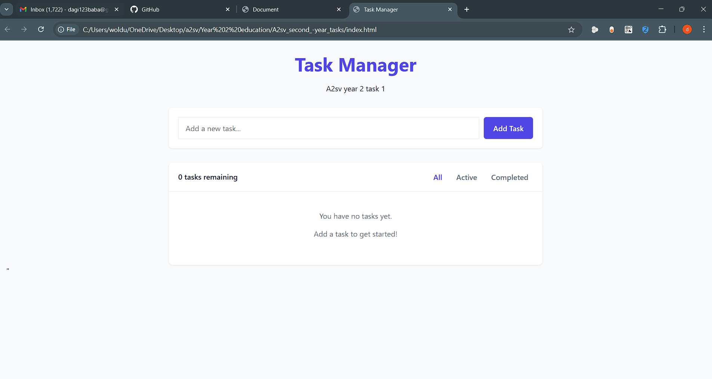
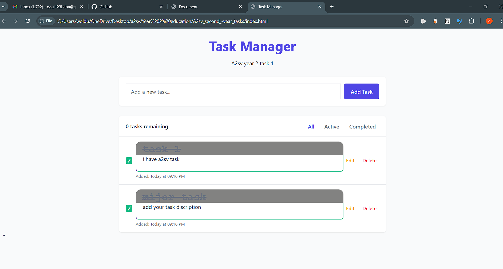

#Task Tracker App

A simple task tracker web application built using HTML, CSS, and JavaScript. This app allows users to add, manage, and delete tasks efficiently.

##Features

Add new tasks with a title and description

Mark tasks as completed

Delete tasks when no longer needed

#Screenshots 
=====================================================================================================================================================================

| Home  Screen      |          adding taks Screen       |
|--------------------|-------------------|--------------------|
|         | |
|--------------------|-------------------|--------------------|
 Feature Screen     |            Feature Screen     |
 |        | 
 

=====================================================================================================================================================================

#Installation

To set up and run the Task Tracker App on your local machine, follow these steps:

Prerequisites

Ensure you have the following installed:

A modern web browser (Chrome, Firefox, Edge, etc.)

A code editor (VS Code, Sublime Text, etc.)

#Steps

Clone the Repository

- git clone https://github.com/yourusername/task-tracker.git
- cd task-tracker

- Open the Project

- Navigate to the project folder.

- Open the index.html file in your browser.

- Run the App

- No additional setup is needed. The app runs directly in the browser.

#Usage
=====================================================================================================================================================================

Enter a task name and description.

Click the "Add Task" button.

Mark tasks as completed by clicking on them.

Click the delete icon to remove a task.

#Contributing
=====================================================================================================================================================================

If you'd like to contribute:

Fork the repository.

Create a new branch for your feature (git checkout -b feature-name).

Commit your changes (git commit -m "Added new feature").

Push to the branch (git push origin feature-name).

Create a pull request.

License

This project is licensed under the MIT License.

Enjoy tracking your tasks! 🚀
