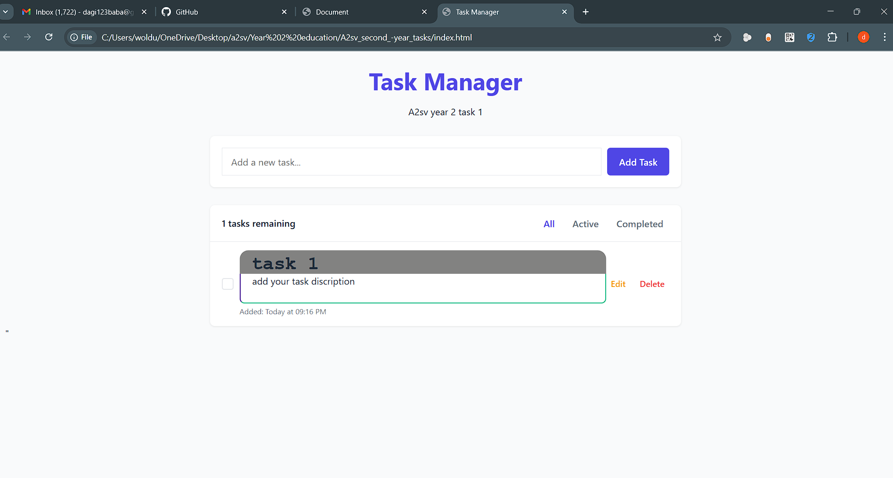

 **#Task Tracker App**

A simple task tracker web application built using HTML, CSS, and JavaScript. This app allows users to add, manage, and delete tasks efficiently.

**#Features**

✅ Add new tasks with a title and description
✅ Mark tasks as completed
✅ Delete tasks when no longer needed
✅ Responsive design for mobile and desktop use

#Screenshots 
=====================================================================================================================================================================

|--------------------|-------------------|--------------------|
|         | |
|--------------------|-------------------|--------------------|

 |        | 
 

=====================================================================================================================================================================

#Installation

To set up and run the Task Tracker App on your local machine, follow these steps:

Prerequisites

Ensure you have the following installed:
✅ A modern web browser (Chrome, Firefox, Edge, etc.)✅ A code editor (VS Code, Sublime Text, etc.)

Steps
 ✅ Clone the Repository
      git clone https://github.com/yourusername/task-tracker.git
      cd task-tracker
✅ Open the Project
      Navigate to the project folder.
      Open the index.html file in your browser.
✅ Run the App
      No additional setup is needed. The app runs directly in the browser.

Usage
    ✅ Enter a task name and description.
    ✅ Click the "Add Task" button.
    ✅ Mark tasks as completed by clicking on them.
    ✅ Click the delete icon to remove a task.

Contributing

If you'd like to contribute:
✅ Fork the repository.
✅ Create a new branch for your feature (git checkout -b feature-name).
✅ Commit your changes (git commit -m "Added new feature").
✅ Push to the branch (git push origin feature-name).✅ Create a pull request.

License
               This project is licensed under the MIT License.

                  Enjoy tracking your tasks! 🚀
