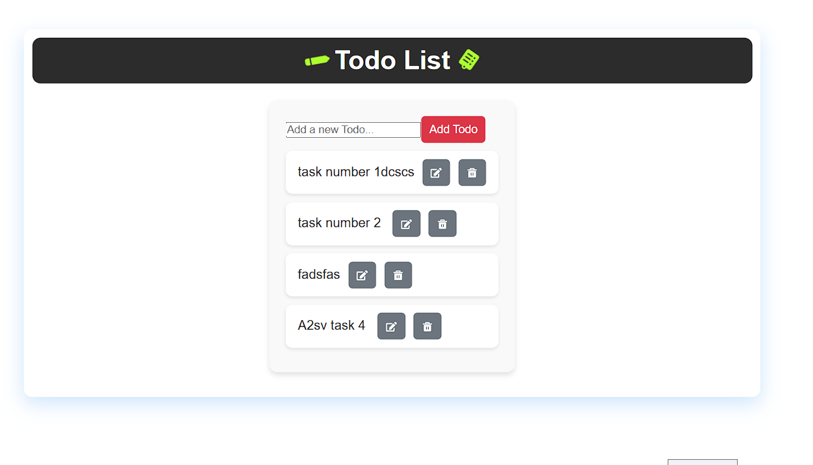

# Todo list with :React + TypeScript 

A simple boilerplate to kickstart your React application using TypeScript.


## 🚀 Features

- **Task adding ** – add tasks wherere the details and the time stamp is attached 
- **Task editing** – updating the task that has been created previously 
- **Task Listing** – Read the Task list and change the list  when ever it is updated
- **Task Deleting ** –  REmoving task from the list 
- **Task checking ** –  checking task done and which add a line over it 


---
## 📸 Screenshots


---

## 🛠 Technologies Used

- ⚛️ React 18+
- 🔠 TypeScript
- 💅 Pre-configured with CSS Modules
- 🧪 Ready for unit testing (Jest + React Testing Library)
- 🌐 Fast development with Vite or CRA (select your preference)

---
## ✅ Prerequisites

- Node.js (v14 or higher)  
- npm or pnpm

---

## 🔧 Installation

1. Clone the repository:

git clone https://github.com/your-username/job-listing-app.git
cd job-listing-app 

2 Install dependencies:
npm install
🚀 Run the Development Server
Start the development server:
```bash
npm run dev
````
---
