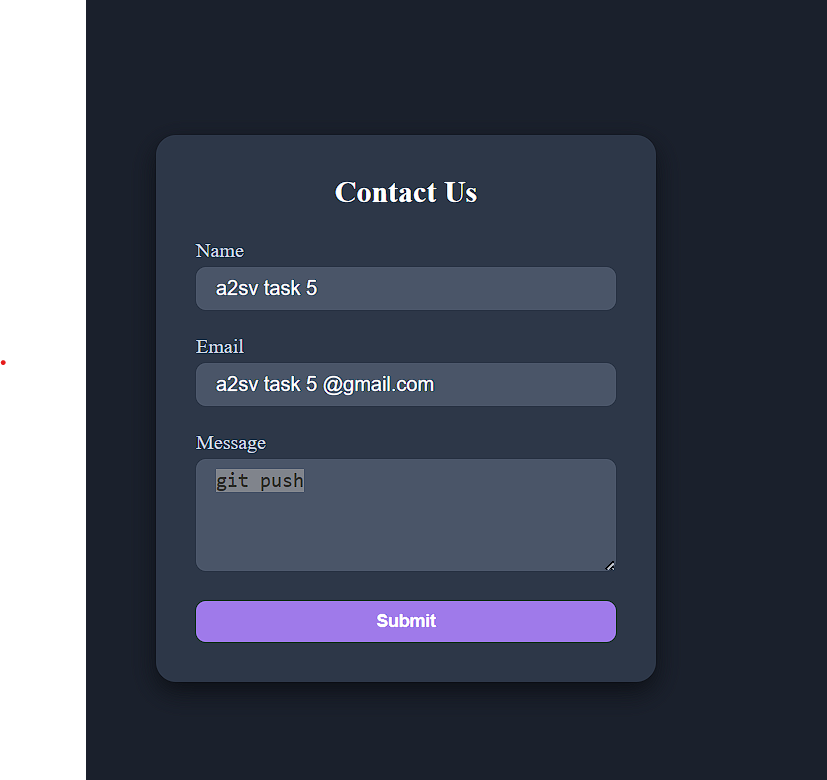

🎯 Task Overview
There is a React form component that can be accessed via the main route:
/urr/form

📄 Form Features
The form includes the following functionalities:

🎓 University Application Submission
Users can apply to universities directly through the form.

❌ Error Handling & Validation
Robust validation is in place to catch and display form errors in real-time.

🛠️ Dynamic Functionality
The form adapts to user input and guides them through a smooth application process.

If you’d like this in a different format (HTML, Flutter, or React JSX with actual icon components), just let me know!
