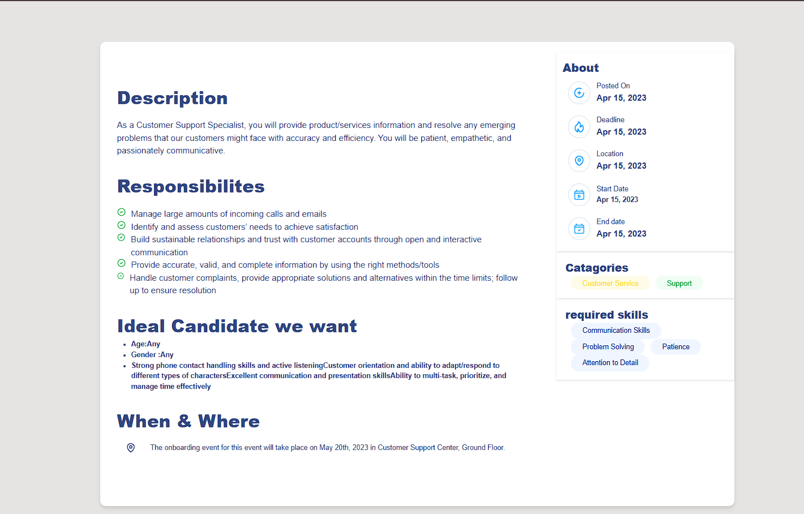
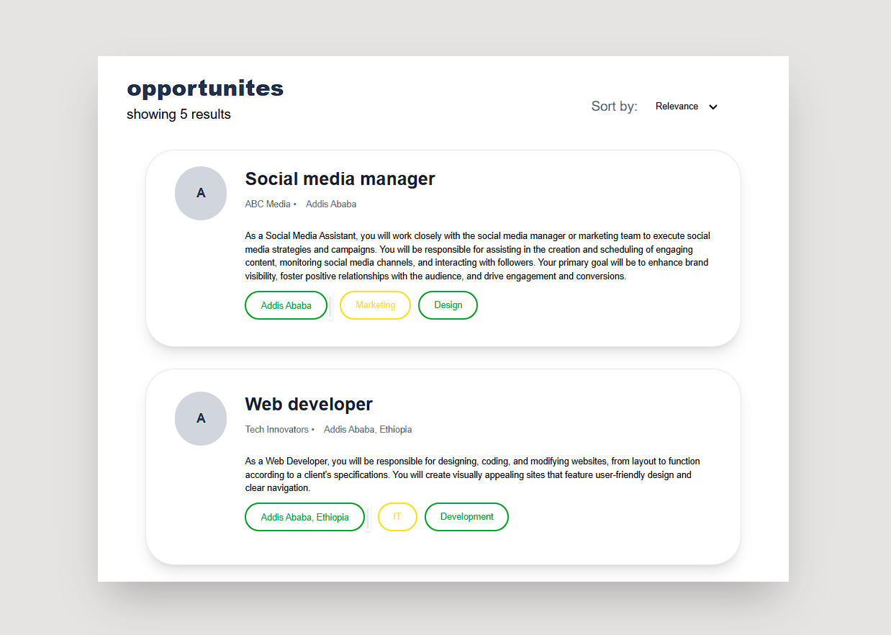

# Task 6 - Job Listing

A simple and modern job listing application built with **React**, **TypeScript**, and **Tailwind CSS**. It allows users to browse job opportunities, view detailed information, and filter listings using tags.

---

## 🚀 Features

- **Job Listings Dashboard** – Browse all available job opportunities with a clean, card-based UI.
- **Detailed Job View** – View comprehensive job details including responsibilities, requirements, and company info.
- **Responsive Design** – Fully responsive layout that works seamlessly across desktops and mobile devices.
- **Tag-based Filtering** – Easily filter jobs using intuitive, tag-based categorization.
- **Modern UI** – Clean, professional design with attention to user experience and detail.

---

## 📸 Screenshots

<table>
  <tr>
    <td></td>
    <td></td>
  </tr>
</table>

---

## 🛠 Technologies Used

- **React** – For building dynamic user interfaces  
- **TypeScript** – Static typing to enhance code quality and maintainability  
- **Tailwind CSS** – Utility-first CSS framework for fast styling  
- **React Router** – Client-side routing between pages  
- **React Icons** – Consistent and scalable icons  
- **Vite** – Lightning-fast development and optimized builds  

---

## 📁 Project Structure

src/ ├── components/ # Reusable UI components │ ├── JobCard.tsx # Card component for displaying job info │ └── JobList.tsx # Component for listing all jobs │ ├── pages/ # Page-level components │ ├── JobPage.tsx # Detailed view for a specific job │ └── OpportunitiesDashboard.tsx # Dashboard listing all jobs │ ├── data/ │ └── jobs.json # Sample/mock job listing data │ └── hooks/ └── useGetJobs.ts # Custom hook for fetching job data

---

## ✅ Prerequisites

- Node.js (v14 or higher)  
- npm or pnpm

---

## 🔧 Installation

1. Clone the repository:

git clone https://github.com/your-username/job-listing-app.git
cd job-listing-app 

2 Install dependencies:
npm install
🚀 Run the Development Server
Start the development server:
npm run dev
