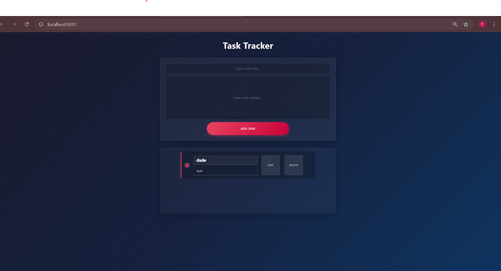
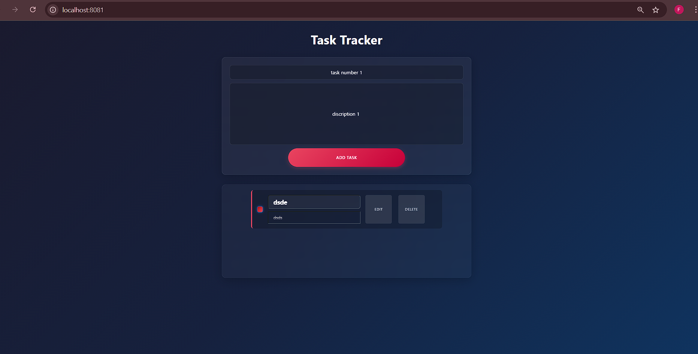
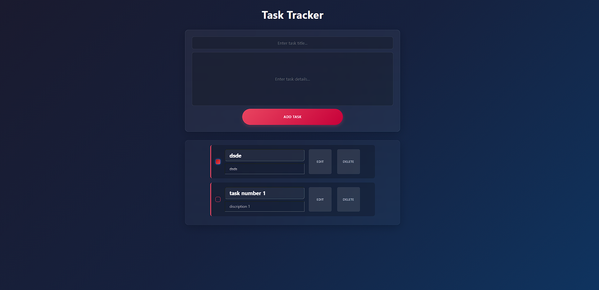
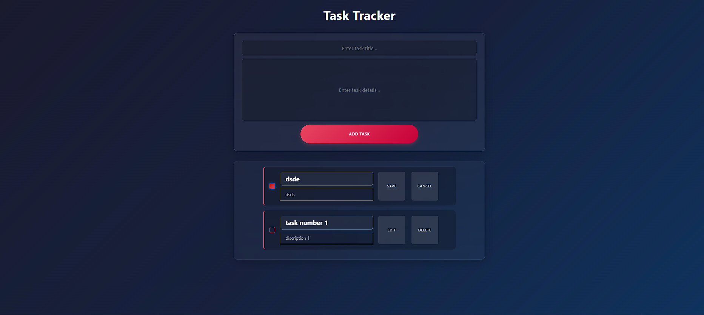

# Task 2 - Todo List app with type script 

A simple To do list app developed using simple type script html and css with out any frame work 
---

## 🚀 Features

- **Task adding ** – add tasks wherere the details and the time stamp is attached 
- **Task editing** – updating the task that has been created previously 
- **Task Listing** – Read the Task list and change the list  when ever it is updated
- **Task Deleting ** –  REmoving task from the list 
- **Task checking ** –  checking task done and which add a line over it 

---

## 📸 Screenshots

<table>
  <tr>
    <td></td>
    <td></td>
  </tr>
  
  <tr>
    <td></td>
    <td></td>
  </tr>
</table>

---
